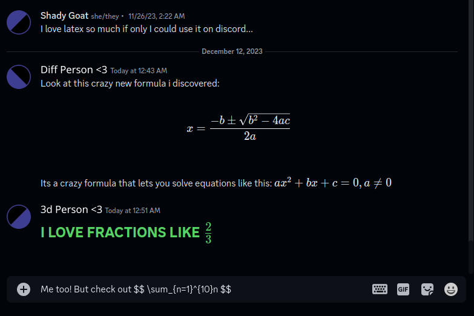

# Latex Plugin

[](https://replugged.dev/install?identifier=eu.shadygoat.Latex)

A [replugged](https://replugged.dev/) plugin that allows you to render latex in Discord.



## Usage

As with other latex in markdown implementations, latex in enclosed in \$. There are 2 modes - inline & block. 

Inline example:
```md
I think my favorite math expression is $ sin(\frac{1}{4} \pi ) = \frac{\sqrt{2}}{2} $. I just love it so much!
```


Block example:
```md
What? Thats a small & stupid expression! My favorite would be this:

$$
\int\frac{1}{\sqrt{a^2 - x^2}}dx = arcsin\left(\frac{x}{a}\right), |x| \lt a
$$
```


## Internals

This is implemented as another markdown component, which is why stuff like headings can affect the font of inline latex nodes. As for the latex rendering, this is implemented using [katex](https://katex.org/). It was chosen over mathjax due it's speed advantages & the advantage of being usable without crazy workarounds.
